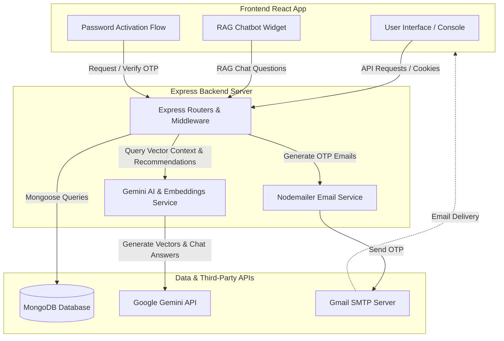

# HostelOS — Hostel Management & AI Assistant Portal

HostelOS is a MERN-stack platform designed to centralize resident onboarding, role-based workflows, automated notifications, and AI-driven assistance. 

---

## 🚀 Tech Stack

### Frontend (Client)
* **Framework**: React.js (Vite)
* **Styling**: Vanilla CSS3 (Custom design system & theme-aware dark/light modes)
* **Icons & Visuals**: Lucide React
* **HTTP Client**: Axios

### Backend (Server)
* **Runtime**: Node.js & Express
* **Database**: MongoDB & Mongoose (Atlas support for Vector Search)
* **Authentication**: JSON Web Tokens (JWT) & HTTP-Only cookies
* **Email Delivery**: Nodemailer (Gmail SMTP integration)
* **File Processing**: Multer & XLSX (Excel/CSV parse engine)

### AI Core
* **Large Language Model**: Google Gemini API (`gemini-2.5-flash`)
* **Vector Embeddings**: Google Gemini Embedding API (`gemini-embedding-001`)

---

## 🗺️ Architecture Diagram



---

## ✨ Features Description

* **RAG Rulebook Chatbot**: Embeds and indexes the hostel PDF rulebook (`Hostel_embedding-merged.pdf`). When a student asks a question, the backend converts it to a vector and fetches matching chunks (falling back to a high-speed local Cosine Similarity algorithm if MongoDB Atlas Vector Index is not configured). Gemini answers using *only* that context.
* **Spreadsheet Bulk Import**: Allows admins to drag-and-drop Excel/CSV rosters. It validates rows against strict schemas, detects duplicate profiles, and handles soft-deleted users (automatically reactivating records if re-imported).
* **First-Time Password Activation**: Instead of open registration, pre-loaded residents activate their accounts by requesting a 6-digit OTP sent to their email via Nodemailer and Gmail SMTP, unlocking the choose password view.
* **Education Hub AI recommendations**: Provides personalized learning paths, top 3 targeted resources, and search suggestions matching a student's branch, academic year, and interests.
* **Role-Based Access Control (RBAC)**: Supports roles (`student`, `co_leader`, `leader`, `admin`) to restrict views. Admins manage directory entries and delete profiles, while students can file complaints and leadership roles can update progress.
* **Active Directory & Complaints Board**: A unified dashboard to monitor public issues, view active resident details, and track assignments. Soft-deleted profiles are automatically hidden from active directory views.

---

## 📁 Project Structure

```text
Hostelly/
├── client/                 # React Frontend
│   ├── src/
│   │   ├── components/     # Reusable UI widgets
│   │   ├── pages/          # Login and routing pages
│   │   ├── Console.jsx     # Main layout, panels, and dashboard view
│   │   └── index.css       # Theme styling configuration
│   └── package.json
│
├── server/                 # Express Backend API
│   ├── src/
│   │   ├── config/         # DB and environmental schemas (env.js)
│   │   ├── models/         # MongoDB Mongoose schemas (User, Task, RulebookChunk)
│   │   ├── routes/         # Express routes (auth, users, tasks, ai)
│   │   ├── services/       # Gemini AI service & Nodemailer Gmail integrations
│   │   ├── scripts/        # Ingestion scripts (ingestRulebook.js)
│   │   └── server.js       # App listener port bootstrapper
│   └── package.json
└── vercel.json             # Global monorepo deployment config
```

---

## ⚠️ Current System Limits (Delimits)

1. **Gemini API Call Limits**: The free tier of the Gemini API limits the number of requests per minute (RPM). High concurrent chatbot usage or bulk recommendations will trigger rate-limit throttling.
2. **Local Vector Search Fallback**: If MongoDB Atlas Vector Index is unindexed or running in local environment setups, rulebook search falls back to in-memory Cosine Similarity matching. While very fast (<10ms) for small datasets, it is not optimized for large datasets.
3. **Soft-Deleted Roster Constraints**: Soft-deleted entries are kept in the database to maintain history. Re-registering them via standard signup is blocked (they must use the "First-time setup" or be re-added to reactivate).

---

## ⏳ Future Implementation Roadmap

* **Automated WhatsApp Birthdays & Notices**: The database schema and notification managers have hooks built-in to support SMS/WhatsApp triggers. Currently, the `WHATSAPP_PROVIDER` is set to `disabled`. The roadmap includes linking this to the Meta WhatsApp Cloud API to send automated birthday greetings and roster warnings.

---

## 🛠️ How to Get Started

### Prerequisites
* Node.js (v18+)
* MongoDB (Local or Atlas cluster)
* Google Gemini API Key

### Installation

1. Clone the repository and install dependencies in the root:
   ```bash
   npm install
   ```

2. Configure environment variables. Create a `.env` file under the `server` directory:
   ```env
   PORT=5000
   CLIENT_URL=http://localhost:5173
   MONGODB_URI=your-mongodb-connection-string
   JWT_SECRET=your-jwt-auth-secret
   GEMINI_API_KEY=your-gemini-api-key
   EMAIL_USER=your-gmail-address@gmail.com
   EMAIL_PASS=your-gmail-app-password
   ```

3. Create a `.env` file under the `client` directory:
   ```env
   VITE_API_URL=http://localhost:5000/api
   VITE_API_BASE_URL=http://localhost:5000/api
   ```

4. Run the rulebook parser script to ingest rulebook PDFs into your database:
   ```bash
   cd server
   node src/scripts/ingestRulebook.js
   ```

5. Run the development servers from the root workspace:
   ```bash
   cd ..
   npm run dev
   ```
   * Frontend will run on: `http://localhost:5173`
   * Backend will run on: `http://localhost:5000`
